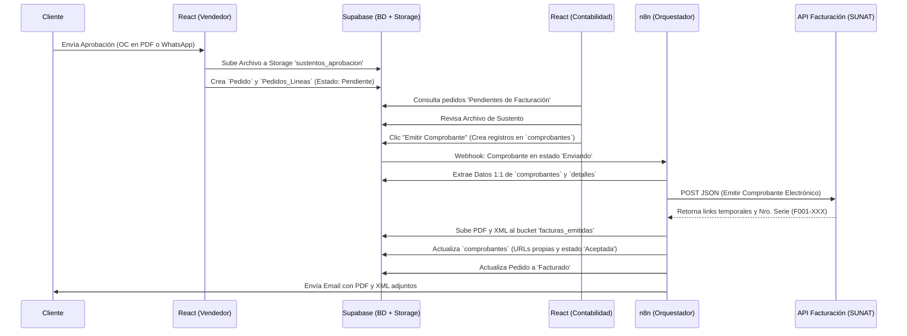
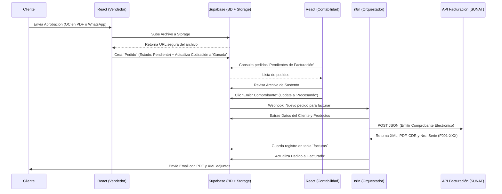

# 📄 DOC 6: Flujo Lógico de Pedidos (Órdenes de Compra) y Facturación

## 🎯 Objetivo del Módulo
Transformar una Cotización en un **Pedido en firme** (con sus propias líneas de detalle y sustento de aprobación), separando estrictamente la "Venta" del "Documento Legal". Posteriormente, delegar a Contabilidad la **Pre-Facturación** (creación del comprobante en base de datos) y usar n8n para automatizar la emisión en SUNAT, respaldar los XML/PDF en nuestro Storage y enviar el correo al cliente.

---

## 🧑‍💻 FASE 1: Aprobación y Creación del Pedido (Rol: Ventas)

Esta fase ocurre en el Frontend (React) y es ejecutada por el **Vendedor**.

1. **Recepción de Confirmación:** El vendedor recibe la aprobación del cliente por correo electrónico (adjuntando un PDF de su Orden de Compra) o por WhatsApp.
2. **Interacción en React:**
   * El vendedor ingresa al módulo de `Cotizaciones`.
   * Filtra las cotizaciones con estado `"Enviada"`.
   * Selecciona la cotización correspondiente y hace clic en el botón de acción: **"Generar Pedido"**.
3. **Validación de Sustentos y Líneas (Modal Maestro):**
   * Se abre un Pop-up. El sistema solicita:
     * `Nro. de OC del Cliente`: **Opcional** (Ej: *OC-45091*).
     * `Sustento de Aprobación`: **Obligatorio**. El vendedor debe arrastrar y soltar el archivo PDF de la OC o la captura de pantalla de WhatsApp.
     * `Fecha de Pedido`: **Opcional** (Asume la fecha actual por defecto).
     * `Observaciones`: **Opcional** (Ej: "Pago a 30 días", "Entrega en obra").
   * **Tabla de Productos Editable:** React muestra las líneas que venían de la cotización. El vendedor puede ajustar las cantidades (Ej: si el cliente cotizó 10 pero finalmente mandó OC solo por 8) sin afectar la cotización original.
4. **Procesamiento (Supabase):**
   * React sube el archivo al bucket de Supabase Storage llamado `sustentos_aprobacion` y obtiene la URL pública/segura del archivo.
   * Se inserta un nuevo registro en la tabla `pedidos`, **vinculando explícitamente el ID de la cotización original (`cotizacion_id`)** y guardando la URL del archivo de sustento.
   * Se insertan los productos confirmados en la tabla `pedidos_lineas` **(vinculándolos al nuevo `pedido_id` generado en el paso anterior)**.
   * Se actualiza la tabla `cotizaciones`, cambiando su estado a **`"Ganada"`** (o `"Aprobada"`).
   * El estado inicial del nuevo pedido será **`"Pendiente Facturación"`**.

---

## 👩‍💼 FASE 2: Pre-Facturación y Emisión (Rol: Contabilidad / Administrador)

Esta fase garantiza la separación de funciones. Es ejecutada en React por un usuario con rol **Admin** o **Contabilidad**.

1. **Bandeja de Entrada Contable:**
   * El usuario ingresa al módulo de `Facturación` en React.
   * Visualiza un listado de todos los pedidos en estado `"Pendiente Facturación"`.
2. **Auditoría Visual:**
   * El usuario hace clic en un pedido para revisarlo.
   * El sistema le permite **"Ver Sustento"** (Abre el PDF o imagen para corroborar que la venta es real y los montos cuadran con el pedido).
3. **Pre-Facturación (Generación del Borrador Legal y Detalles):**
   * El usuario selecciona el tipo de comprobante (Factura o Boleta filtrado desde `cat_tipo_documento` Ej: Factura `01` o Boleta `03`).
   * **Asignación de Serie (React):** Al seleccionar el tipo de documento, React consulta la tabla `configuracion_series` para obtener la Serie correspondiente (Ej: `F001`) y muestra una vista previa del siguiente correlativo disponible.
   * Llena o edita campos faltantes en la cabecera (Ej: dirección de facturación, tipo de moneda, detracciones).
   * **Carga y Validación de Líneas:** React carga automáticamente los productos desde la tabla `pedidos_lineas` en una tabla editable.
   * **Asignación de Códigos SUNAT:** 
     * En la tabla, React autocompleta las columnas de "Unidad" (`NIU`, `ZZ`) y "Afectación IGV" (`10`, `20`) consultando la configuración original del ítem en la tabla `productos`. 
     * Para ítems personalizados (sin `producto_id`), asigna valores por defecto (`NIU` y `10`). 
     * El contador tiene la potestad de **editar estos Dropdowns en cada fila** antes de emitir, asegurando la precisión tributaria.
   * **Magia Matemática en React (Traducción a SUNAT):** 
     * Por cada línea, React extrae el IGV, calcula el `mto_valor_unitario` (precio sin IGV), la base imponible `mto_base_igv`, y recalcula los totales.
     * React calcula el monto total en letras (Ej: *"SON CIEN Y 00/100 SOLES"*) usando una librería y lo asigna al campo `leyenda_monto`.
4. **Disparo a SUNAT (Generación Segura):**
   * El usuario hace clic en el botón: **"Emitir Comprobante Electrónico"**.
   * **Transacción Segura (Supabase):** El sistema incrementa en +1 el `correlativo_actual` de la tabla `configuracion_series` (Ej: de 126 a 127) y bloquea el número para evitar duplicados.
   * Se inserta la cabecera definitiva en la tabla **`comprobantes`** (con serie `F001`, correlativo `127` y estado `"Enviando"`)
   * Inmediatamente, inserta todos los productos procesados en la tabla **`comprobantes_detalles`**, vinculándolos al ID del comprobante recién generado (`comprobante_id`).
   * React actualiza el estado del pedido a `"Procesando Facturación"`.
   * El cambio en la tabla `comprobantes` dispara un **Webhook** hacia n8n.

### **Paso Adicional para confguración de series y correlativos: En la Pantalla (React)**
1. Cuando el Contador entra a la pantalla de Pre-Facturación y selecciona en el Dropdown: **"01 - FACTURA"**.
2. React consulta la tabla `configuracion_series` e identifica la secuencia: *"Tu serie activa para Facturas es la `F001`. El siguiente número será el `127`"*.
3. El contador ve en la interfaz visual: **Comprobante a emitir: F001 - 127** *(Como una vista previa).*

### **Paso B: Al dar clic en "Emitir" (Supabase RPC / Transacción Segura)**
No permitiremos que React envíe el número `127` directamente en el `INSERT`. Si otro contador le da clic a emitir exactamente al mismo tiempo, habría un choque (problema de concurrencia). 

Para solucionarlo, usaremos una **Función Segura (RPC)** en Supabase que ejecuta una transacción atómica y hace tres cosas en 1 milisegundo:
1. **"Congela"** (Bloquea) la fila de la serie `F001` en la tabla para que ningún otro proceso la toque.
2. **Suma +1** al campo `correlativo_actual` (ahora es seguro que el valor es `127`).
3. **Inserta** la factura en la tabla `comprobantes` utilizando ese `127` exacto.

*(Nota técnica: En Supabase, esto se logra creando una sencilla "Postgres Function" que React llamará desde el frontend utilizando un comando como `supabase.rpc('emitir_comprobante', {datos})`).*
1. Nueva Tabla en Supabase (Configuración de Series)
Agregaremos esta tabla a tu esquema SQL:

SQL
-- TABLA: Control de Series y Correlativos
CREATE TABLE configuracion_series (
    id UUID PRIMARY KEY DEFAULT gen_random_uuid(),
    tipo_doc_codigo VARCHAR(2) REFERENCES cat_tipo_documento(codigo) ON DELETE RESTRICT,
    serie VARCHAR(4) NOT NULL UNIQUE, -- Ej: 'F001', 'B001', 'FC01'
    correlativo_actual INTEGER NOT NULL DEFAULT 0, -- Aquí guardaremos el último número emitido
    activo BOOLEAN DEFAULT true
);

-- Insertamos tus series iniciales
INSERT INTO configuracion_series (tipo_doc_codigo, serie, correlativo_actual) VALUES
('01', 'F001', 0), -- Facturas
('03', 'B001', 0), -- Boletas
('07', 'FC01', 0), -- Notas de Crédito de Facturas
('07', 'BC01', 0); -- Notas de Crédito de Boletas

---

## 🤖 FASE 3: Orquestación, SUNAT y Respaldo (Rol: n8n + API Facturación)

Este es el **Workflow 3** en n8n. Un flujo *Backend* 100% invisible para el usuario. n8n actúa como mensajero, sin hacer cálculos matemáticos.

1. **Trigger (Webhook):** n8n recibe la alerta de Supabase indicando que un `comprobante` tiene el estado `"Enviando"`.
2. **Gathering (Recopilación de Datos):**
   * n8n consulta la base de datos (Supabase) extrayendo la cabecera del comprobante, sus líneas de detalle (`comprobantes_detalles`), y los datos del cliente. 
3. **Petición a Proveedor Electrónico (HTTP Request 1):**
   * n8n mapea los datos (1 a 1, sin alterar valores) a la estructura JSON requerida por la API de facturación (Ej: *ApisPeru*).
   * n8n envía el POST Request a la API.
4. **Recepción de Respuesta:**
   * La API responde con éxito, devolviendo: `Serie y Número` (Ej: F001-00024) y las URLs temporales del `PDF`, `XML` y `CDR` (Constancia de Recepción).
5. **Descarga y Respaldo en Supabase Storage (HTTP Request 2 & 3):**
   * n8n descarga los archivos PDF y XML desde el proveedor.
   * n8n sube estos archivos binarios directamente al bucket público de Supabase llamado `facturas_emitidas`.
   * *Nomenclatura recomendada:* `F001-00024_RUC.pdf`.
6. **Actualización de Base de Datos (Postgres Node):**
   * n8n actualiza el registro en la tabla `comprobantes`. Cambia el estado a **`"Aceptada"`** y guarda las URLs internas de Supabase Storage en `enlace_pdf` y `enlace_xml`, y la respuesta cruda en `apisperu_response`.
   * Actualiza el registro en la tabla `pedidos`, cambiando su estado a **`"Facturado"`**.
7. **Notificación al Cliente (Gmail Node):**
   * n8n redacta el correo. Asunto: `Factura Electrónica[F001-00024] - [Tu Empresa SAC]`.
   * Adjunta los archivos PDF y XML que acaba de respaldar.
   * Envía el correo. **Fin del Flujo.**

---

## 📊 Diagrama Visual del Flujo (Mermaid)

*Copia este bloque en Notion o Mermaid Live para visualizar el diagrama.*

---

### 💡 Notas Técnicas de Implementación para React + Supabase:

1. **Configuración de RLS (Row Level Security):** Al crear el bucket `sustentos_aprobacion` en Supabase Storage, asegúrate de configurarlo como **Privado**. El bucket `facturas_emitidas` puede ser **Público** para facilitar la descarga desde el panel.
2. **Manejo de Errores de SUNAT:** En n8n, debes agregar un "Nodo Catch" o "If Error". Si la API del proveedor devuelve un error (ej. "RUC no válido"), n8n debe actualizar el comprobante en Supabase a **`"Rechazada"`** y guardar el error en `apisperu_response`. El Pedido debe volver al estado **`"Error de Facturación"`** para que Contabilidad lo vea en rojo en su dashboard, corrija el dato y vuelva a intentarlo.
3. **Link a diagrama de base de datos:** https://dbdiagram.io/d/Diagrama-ER-BDcotizaciones-69b0200fcf54053b6f4ec3c6

---

## 🤖 FASE 3: Orquestación y SUNAT (Rol: n8n + API Facturación)

Este es el **Workflow 3** en n8n. Es un flujo *Backend* 100% invisible para el usuario, que se encarga de hablar con la SUNAT y notificar al cliente.

1. **Trigger (Webhook):** n8n recibe la alerta indicando que un pedido necesita ser facturado.
2. **Gathering (Recopilación de Datos):**
   * n8n consulta la base de datos (Supabase) para obtener: Datos del cliente (RUC, Razón Social, Dirección), detalles de los ítems cotizados (Cantidades, Precios, IGV), y el Nro. de Orden de Compra del cliente (si existe, para incluirlo en la factura como referencia) y datos adicionales para la factura.
3. **Petición a Proveedor Electrónico (HTTP Request):**
   * n8n mapea los datos a la estructura JSON requerida por el proveedor de facturación (Ej: *ApisPeru* o *Facturador.pe*).
   * n8n envía el POST Request a la API del proveedor.
4. **Recepción de Comprobante:**
   * La API responde con éxito, devolviendo: `Serie y Número` (Ej: F001-00024), `Enlace al PDF de la Factura`, `Enlace al XML` y `Enlace al CDR` (Constancia de Recepción de SUNAT).
5. **Descarga y Respaldo en Supabase Storage (HTTP Request 2 & 3):**
   * n8n descarga el PDF y el XML utilizando las URLs proporcionadas por el proveedor.
   * n8n sube estos archivos binarios directamente a un nuevo bucket en tu Supabase llamado facturas_emitidas.
   * Nomenclatura recomendada: F001-00024_RUC_Cliente.pdf y F001-00024_RUC_Cliente.xml.
6. **Actualización de Base de Datos (Postgres Node):**
   * n8n inserta un nuevo registro en la tabla `facturas` guardando todos los enlaces y el número de serie.
   * Importante: Guarda las URLs internas de tu Supabase Storage (no las del proveedor) en los campos enlace_pdf y enlace_xml.
   * Actualiza el registro en la tabla `pedidos`, cambiando su estado a **`"Facturado"`**.
6. **Notificación al Cliente (Gmail Node):**
   * n8n redacta el correo: Asunto: Factura Electrónica [F001-00024] - [Tu Empresa SAC].
   * Adjunta los archivos PDF y XML que acaba de procesar.
   * Envía el correo. **Fin del Flujo.**

---

## 📊 Diagrama Visual del Flujo (Mermaid)

*Copia este bloque en Notion o Mermaid Live para visualizar el diagrama.*

---

### 💡 Notas Técnicas de Implementación para React + Supabase:

1. **Configuración de RLS (Row Level Security):** Al crear el bucket `sustentos_aprobacion` en Supabase Storage, asegúrate de configurarlo como **Privado**, no público. Así evitas que la información financiera de tus clientes quede expuesta en internet.
2. **Manejo de Errores de SUNAT:** En n8n, debes agregar un "Nodo Catch" o "If Error". Si la API del proveedor de facturación electrónica devuelve un error (ej. "RUC no válido" o "SUNAT caído"), n8n debe actualizar el pedido en Supabase a **`"Error de Facturación"`** para que Contabilidad lo vea en rojo en su dashboard de React y corrija el dato.